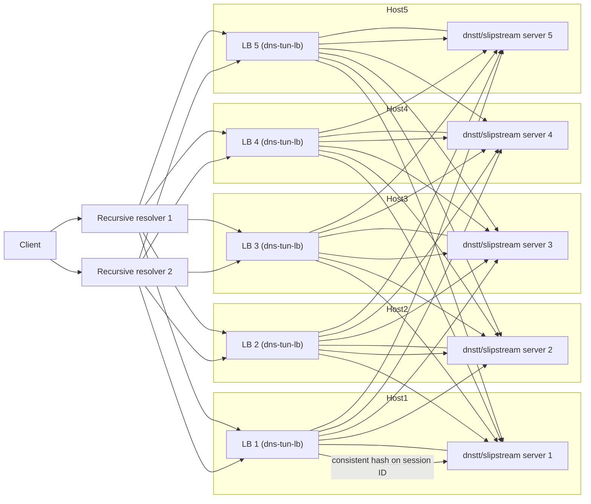

## dns-tun-lb (DNS tunnel load balancer)

`dns-tun-lb` is a small, stateless UDP load balancer for DNS tunneling
protocols. It supports **dnstt** and **slipstream**.

The LB:

- Listens on a single UDP address (typically port 53 behind DNAT).
- Parses incoming DNS queries.
- Routes by **configured domain suffix only** (longest match): no protocol
  detection. If the query QNAME matches a pool’s `domain_suffix`, the request
  is sent to that pool’s backends. All QTYPEs (TXT, A, CNAME, etc.) are sent
  to the pool when the name matches.
- Extracts a session identifier per protocol (dnstt: 8-byte ClientID from the
  QNAME prefix; slipstream: 8-byte connection ID from the QUIC payload) for
  consistent hashing. If extraction fails, the full QNAME is used so the same
  query still hits the same backend.
- Uses a per-pool consistent hash ring for per-session stickiness.
- For queries that match no pool, forwards to a recursive resolver or drops,
  depending on configuration.

The LB is **stateless per node**: there are no health checks, no shared
state, and no coordination between instances. Given the same configuration,
different instances will make the same routing decision for a given packet.

---

### Quick start

#### Local binary

Prereqs:

- Go 1.22+ (tested with Go 1.24).

Build and run from `dns-tunnel/dns-tunnel-lb`:

```bash
go build -o dns-tun-lb .
./dns-tun-lb -config lb.yaml
```

`lb.yaml` is just an example; in production you should supply your own config
with your real listen address, tunnel domains, backends, and resolver policy.

Run with `logging.level: "debug"` to see which backend each session maps to.

#### Docker

- **Prebuilt image** (recommended starting point):

  ```bash
  docker run --rm \
    -p 53:53/udp \
    --cap-add=NET_BIND_SERVICE \
    -v $(pwd)/lb.yaml:/etc/dns-tun-lb.yaml:ro \
    --name dns-tun-lb \
    ghcr.io/aleskxyz/dns-tun-lb:latest
  ```

- **Build locally**:

  ```bash
  docker build -t dns-tun-lb .

  docker run --rm \
    -p 53:53/udp \
    --cap-add=NET_BIND_SERVICE \
    -v $(pwd)/lb.yaml:/etc/dns-tun-lb.yaml:ro \
    --name dns-tun-lb \
    dns-tun-lb
  ```

---

### Configuration

Configuration is provided as a YAML file (passed with `-config`, default
`lb.yaml`).

```yaml
global:
  listen_address: "0.0.0.0:53"
  metrics_listen: ":2112"      # Prometheus /metrics; empty = disabled
  read_timeout: "10s"           # max wait for UDP response (forward + backend); default 10s

  default_dns_behavior:
    mode: "forward"          # "forward" | "drop"
    forward_resolver: "9.9.9.9:53"

protocols:
  dnstt:
    pools:
      - name: "dnstt-main"
        domain_suffix: "t.example.com"
        backends:
          - id: "dnstt-1"
            address: "10.0.0.11:5300"
          - id: "dnstt-2"
            address: "10.0.0.12:5300"
          # ... more backends
  slipstream:
    pools:
      - name: "slipstream-main"
        domain_suffix: "s.example.com"
        backends:
          - id: "slipstream-1"
            address: "10.0.0.21:5300"

logging:
  level: "info"              # "error" | "info" | "debug"
```

**Command-line flags**

- **`-config`** (default `lb.yaml`): path to the YAML config file. All other settings (listen address, metrics, timeouts, etc.) are taken from the config.

For the same pool, a minimal **authoritative DNS configuration** for a cluster
of 5 load balancers might look like this:

```text
; Load balancer addresses
tns1.example.com.   IN  A     203.0.113.10
tns2.example.com.   IN  A     203.0.113.11
tns3.example.com.   IN  A     203.0.113.12
tns4.example.com.   IN  A     203.0.113.13
tns5.example.com.   IN  A     203.0.113.14

; Delegate the tunnel zone to the LBs
t.example.com.      IN  NS    tns1.example.com.
t.example.com.      IN  NS    tns2.example.com.
t.example.com.      IN  NS    tns3.example.com.
t.example.com.      IN  NS    tns4.example.com.
t.example.com.      IN  NS    tns5.example.com.
```

- **`global.listen_address`**: UDP address the LB listens on. In production
  you typically run on an unprivileged port and DNAT external UDP/53 to this
  address.
- **`global.metrics_listen`**: Address for the Prometheus HTTP server (e.g. `":2112"`). Metrics are exposed at `http://<addr>/metrics`. If empty or omitted, the metrics server is not started.
- **`global.read_timeout`**: Maximum time to wait for a UDP response when
  forwarding to the resolver or to a tunnel backend. Go duration string
  (e.g. `"10s"`, `"30s"`, `"1m"`). Default is `10s` if omitted or invalid.
  Prevents goroutines from blocking indefinitely on unresponsive peers.
- **`default_dns_behavior`**:
  - `mode: "forward"`: forward non-tunnel DNS to `forward_resolver` and
    relay responses.
  - `mode: "drop"`: silently drop non-tunnel DNS.
  - If `mode: "forward"` is set, `forward_resolver` is required (e.g.
    `"9.9.9.9:53"` or `"resolver.example.com:53"`; host may be IP or domain);
    otherwise the LB will fail to start.
- **`protocols.dnstt.pools[]`** and **`protocols.slipstream.pools[]`**:
  - `domain_suffix`: QNAME suffix for this pool (e.g. `t.example.com`). The LB
    uses **longest match**: if multiple pools match the query name, the one
    with the longest suffix wins. **Each `domain_suffix` must be unique**
    across all pools (dnstt and slipstream). Empty suffix is rejected.
  - `backends[]`: UDP endpoints (e.g. `dnstt-server` or `slipstream-server`).
    Each backend has `id` (for metrics) and `address` in `host:port` form;
    `host` may be an IP or a domain name (resolved at dial time). Pools with
    no backends are skipped.
- **`logging.level`**:
  - `"error"`: only errors.
  - `"info"`: high-level lifecycle and summary (default).
  - `"debug"`: per-session routing and pool details.

---

### Routing and session stickiness

For each incoming DNS query (with exactly one question):

- The LB finds the **longest matching** pool: the pool whose `domain_suffix`
  matches the query QNAME (exact or subdomain, case-insensitive) and has the
  longest suffix length. If none match, the packet is forwarded or dropped
  according to `default_dns_behavior`.
- For the matched pool, a **session ID** is derived:
  - **dnstt**: first 8 bytes of the base32-decoded QNAME prefix (ClientID). If
    the prefix is missing, invalid base32, or decodes to fewer than 8 bytes,
    the full normalized QNAME is used instead.
  - **slipstream**: 8-byte connection ID from the QUIC payload in the QNAME
    (long header: SCID; short header: first 8 bytes of DCID). If the payload
    is too short or invalid, the full normalized QNAME is used instead.
- The backend is chosen with a per-pool consistent hash over
  `(protocol, domain_suffix, session_id)`. All packets for the same session
  go to the same backend while pool membership is unchanged.

---

### Metrics

When `global.metrics_listen` is set in the config (e.g. `":2112"`), the LB
serves Prometheus metrics at `http://<addr>/metrics`.

**Frontend (incoming traffic)**

| Metric | Type | Labels | Description |
|--------|------|--------|-------------|
| `dns_lb_requests_total` | counter | `protocol` | Total requests by protocol (`dnstt`, `slipstream`, `other`). |
| `dns_lb_routed_requests_total` | counter | `protocol`, `pool` | Requests routed to tunnel backends. |
| `dns_lb_forwarded_requests_total` | counter | — | Requests forwarded to upstream resolver. |
| `dns_lb_dropped_requests_total` | counter | `reason` | Dropped requests (e.g. `no_forwarder`, `forward_read_error`). |
| `dns_lb_frontend_packets_in_total` | counter | — | UDP packets received on the frontend. |
| `dns_lb_frontend_packets_out_total` | counter | — | UDP packets sent to clients. |
| `dns_lb_frontend_bytes_in_total` | counter | — | Bytes received on the frontend. |
| `dns_lb_frontend_bytes_out_total` | counter | — | Bytes sent to clients. |
| `dns_lb_parse_errors_total` | counter | `stage` | DNS unpack or parse errors (e.g. `dns_unpack`). |
| `dns_lb_unsupported_queries_total` | counter | `qtype` | Non-TXT queries routed to tunnel pools (counted by QTYPE; still sent to backend). |

**Backend (per pool/backend)**

| Metric | Type | Labels | Description |
|--------|------|--------|-------------|
| `dns_lb_backend_requests_total` | counter | `protocol`, `pool`, `domain`, `backend_id` | Requests routed to each backend. |
| `dns_lb_backend_packets_sent_total` | counter | same | Packets sent to backend. |
| `dns_lb_backend_packets_received_total` | counter | same | Packets received from backend. |
| `dns_lb_backend_bytes_sent_total` | counter | same | Bytes sent to backend. |
| `dns_lb_backend_bytes_received_total` | counter | same | Bytes received from backend. |
| `dns_lb_backend_errors_total` | counter | same + `stage` | Errors by stage: `resolve`, `dial`, `write`, `read`. |
| `dns_lb_backend_sessions_total` | counter | same | Distinct sessions observed per backend. |
| `dns_lb_backend_sessions_active` | gauge | same | Approximate active sessions (TTL-based). |

---

### End-to-end flow diagram



---

### Future work / TODO

- **Add server weight**: support per-backend weights in the consistent hash ring to bias load toward larger servers.
- **Add max connections per server**: enforce a soft cap on active sessions per backend and optionally spill to others.
- **Add health checks**: periodically probe backends and temporarily avoid routing new sessions to unhealthy ones.
- **Add load balancer clustering to share health state**: exchange health information between LB instances so they make consistent routing decisions based on shared view of backend status.

